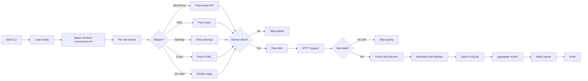

# LinkHarvest Flowchart

## High‑Level Overview

```mermaid
flowchart LR
  A[Start CLI] --> B[Load config]
  B --> C[Spawn workers concurrency=N]
  C --> D[Per-site worker]
  D --> E{Adapter?}
  E -->|WordPress| F1[Fetch posts API]
  E -->|RSS| F2[Fetch feed]
  E -->|Sitemap| F3[Fetch sitemap]
  E -->|Crawl| F4[Fetch HTML]
  E -->|JS-crawl| F5[Render page]
  F1 --> R{Robots allow?}
  F2 --> R
  F3 --> R
  F4 --> R
  F5 --> R
  R -->|No| S[Skip politely]
  R -->|Yes| T[Rate limit]
  T --> U[HTTP request]
  U --> V{New data?}
  V -->|No 304| W[Skip quickly]
  V -->|Yes| X[Parse and discover]
  X --> Y[Normalize and dedupe]
  Y --> Z[Store in SQLite]
  Z --> AA[Aggregate results]
  AA --> AB[Write reports]
  AB --> AC[Done]
```
