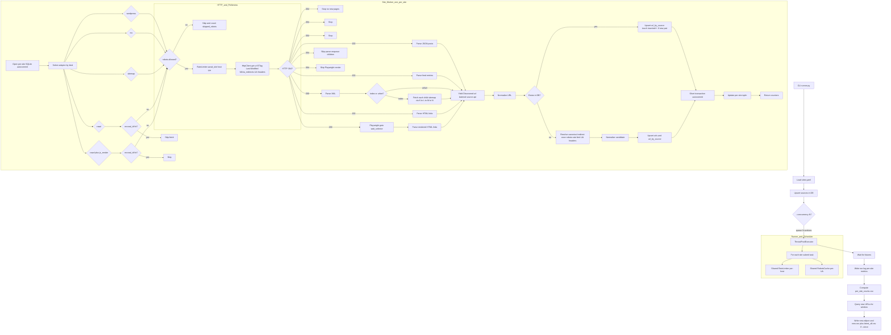
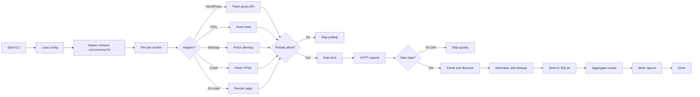

# LinkHarvest Flowcharts

Below are two Mermaid diagrams:
- A detailed technical flowchart of the end-to-end pipeline
- A high‑level overview focused on the main concepts

## Detailed Pipeline

## High‑Level Overview

